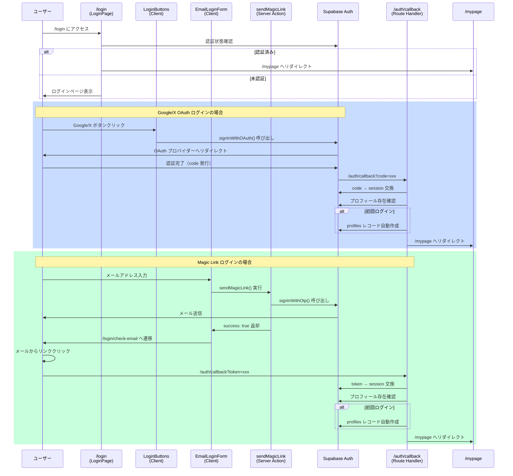

# ログイン機能の実装解説

## 概要

このアプリは **3種類のログイン方法** を提供しています：

1. **Google OAuth 2.0** - Googleアカウントでのログイン
2. **X (Twitter) OAuth 2.0** - X (旧Twitter) アカウントでのログイン
3. **Magic Link（メール認証）** - メールアドレスでのパスワードレスログイン

認証基盤には **Supabase Auth** を使用しています。

---

## ログインフロー全体図



---

## ファイル構成と役割

### 1. ログインページ（`/login`）

#### `src/app/login/page.tsx`
**役割**: ログインページのメインコンポーネント（Server Component）

**処理内容**:
1. サーバー側で認証状態をチェック
2. 既にログイン済みの場合は `/mypage` へリダイレクト
3. 未認証の場合はログインUIを表示

```typescript
export default async function LoginPage() {
  const supabase = await createClient();
  const { data: { user } } = await supabase.auth.getUser();

  // 認証済みユーザーは自動でマイページへ
  if (user) {
    redirect("/mypage");
  }

  return <LoginButtons />; // ログインボタンを表示
}
```

---

#### `src/app/login/login-buttons.tsx`
**役割**: OAuth ログインボタンを提供（Client Component）

**処理内容**:
1. Google と X (Twitter) のログインボタンを表示
2. ボタンクリック時に `signInWithOAuth()` を呼び出し
3. OAuth プロバイダーへリダイレクト

**重要なポイント**:
- `redirectTo: ${origin}/auth/callback` で認証後の戻り先を指定
- ブラウザ側で動作するため `createBrowserClient` を使用

```typescript
const handleGoogleLogin = async () => {
  const { origin } = window.location;
  await supabase.auth.signInWithOAuth({
    provider: "google",
    options: {
      redirectTo: `${origin}/auth/callback`,
    },
  });
};
```

---

#### `src/app/login/email-login-form.tsx`
**役割**: Magic Link 送信フォーム（Client Component）

**処理内容**:
1. メールアドレス入力フォームを表示
2. Server Action `sendMagicLink` を呼び出し
3. 送信成功時に `/login/check-email` へ遷移

**重要なポイント**:
- `useActionState` で Server Action の状態を管理
- フォーム送信中は入力欄とボタンを無効化（`isPending`）

```typescript
const [state, formAction, isPending] = useActionState<
  MagicLinkResult | null,
  FormData
>(sendMagicLink, null);

useEffect(() => {
  if (state?.success) {
    router.push("/login/check-email");
  }
}, [state?.success, router]);
```

---

#### `src/app/login/check-email/page.tsx`
**役割**: Magic Link 送信完了メッセージページ

**処理内容**:
- 「メールを確認してください」というメッセージを表示
- ログインページへの戻るリンクを提供

---

### 2. Server Actions（サーバー側処理）

#### `src/app/actions/magic-link.ts`
**役割**: Magic Link メール送信処理（Server Action）

**処理内容**:
1. メールアドレスのバリデーション
2. Supabase の `signInWithOtp()` で Magic Link を送信
3. 結果を返却（セキュリティ上、常に成功を返す）

**セキュリティ対策**:
- **アカウント列挙攻撃の防止**: エラーがあっても成功を返す
- レート制限エラーのみユーザーに通知

```typescript
export async function sendMagicLink(
  _prevState: MagicLinkResult | null,
  formData: FormData,
): Promise<MagicLinkResult> {
  const email = formData.get("email") as string;

  const { error } = await supabase.auth.signInWithOtp({
    email,
    options: {
      emailRedirectTo: `${origin}/auth/callback`,
    },
  });

  // セキュリティ: アカウント列挙防止のため常に成功を返す
  if (error) {
    console.error("Magic link error:", error.message);
    if (error.message.includes("rate")) {
      return { success: false, error: "しばらく待ってから再試行してください" };
    }
  }

  return { success: true };
}
```

---

#### `src/app/actions/auth.ts`
**役割**: ログアウト処理（Server Action）

**処理内容**:
1. Supabase の `signOut()` でセッションを破棄
2. `/login` へリダイレクト

```typescript
export async function logout() {
  const supabase = await createClient();
  await supabase.auth.signOut();
  redirect("/login");
}
```

---

### 3. OAuth コールバック処理

#### `src/app/auth/callback/route.ts`
**役割**: OAuth/Magic Link 認証後のコールバック処理（Route Handler）

**処理内容**:
1. URL から `code` パラメータを取得
2. `code` をセッションに交換（`exchangeCodeForSession`）
3. プロフィールの存在確認
4. 初回ログインの場合、プロフィールを自動作成
5. `/mypage` へリダイレクト

**プロフィール自動作成ロジック**:

```typescript
// 初回ログイン検出: profiles テーブルをチェック
const { data: existingProfile } = await supabase
  .from("profiles")
  .select("profile_id")
  .eq("owner_user_id", user.id)
  .single();

if (!existingProfile) {
  // 初回ログイン → プロフィール自動作成
  profileId = generateProfileId(); // 15文字のbase62 ID

  const provider = user.app_metadata.provider;
  const metadata = user.user_metadata;

  let displayName: string;
  let avatarUrl: string | null = null;
  let xUsername: string | null = null;

  if (provider === "email") {
    // Magic Link ユーザー
    displayName = user.email?.split("@")[0] || "名無しのけもの";
  } else {
    // OAuth ユーザー
    displayName = metadata.full_name || metadata.name || "名無しのけもの";
    avatarUrl = metadata.avatar_url || metadata.picture || null;
    xUsername = provider === "twitter" ? metadata.user_name || null : null;
  }

  await supabase.from("profiles").insert({
    profile_id: profileId,
    owner_user_id: user.id,
    display_name: displayName,
    avatar_url: avatarUrl,
    x_username: xUsername,
  });
}
```

**プロバイダー別のメタデータ取得**:

| プロバイダー | `display_name` 取得元 | `avatar_url` 取得元 | `x_username` 取得元 |
|------------|---------------------|-------------------|-------------------|
| Google | `metadata.name` | `metadata.picture` | `null` |
| X (Twitter) | `metadata.full_name` | `metadata.avatar_url` | `metadata.user_name` |
| Magic Link | `email.split("@")[0]` | `null` | `null` |

---

### 4. Supabase クライアント作成

#### `src/lib/supabase/server.ts`
**役割**: サーバーサイド用の Supabase クライアント生成

**使用箇所**:
- Server Components (`/login/page.tsx`)
- Route Handlers (`/auth/callback/route.ts`)
- Server Actions (`actions/magic-link.ts`, `actions/auth.ts`)

**重要なポイント**:
- Next.js の `cookies()` を使ってセッションを管理
- Cookie の設定エラーは無視（middleware で処理される）

```typescript
export async function createClient() {
  const cookieStore = await cookies();

  return createServerClient<Database>(
    process.env.NEXT_PUBLIC_SUPABASE_URL!,
    process.env.NEXT_PUBLIC_SUPABASE_ANON_KEY!,
    {
      cookies: {
        getAll() {
          return cookieStore.getAll();
        },
        setAll(cookiesToSet) {
          try {
            for (const { name, value, options } of cookiesToSet) {
              cookieStore.set(name, value, options);
            }
          } catch {
            // サーバーコンポーネントからのsetエラーは無視
          }
        },
      },
    },
  );
}
```

---

#### `src/lib/supabase/client.ts`
**役割**: クライアントサイド用の Supabase クライアント生成

**使用箇所**:
- Client Components (`login-buttons.tsx`)

**重要なポイント**:
- ブラウザ環境でのみ使用
- Cookie は自動的にブラウザが管理

```typescript
export function createClient() {
  return createBrowserClient<Database>(
    process.env.NEXT_PUBLIC_SUPABASE_URL!,
    process.env.NEXT_PUBLIC_SUPABASE_ANON_KEY!,
  );
}
```

---

## ログインフローの詳細

### パターン1: Google OAuth ログイン

```mermaid
graph TD
    A[ユーザーが Google ボタンクリック] --> B[LoginButtons.handleGoogleLogin 実行]
    B --> C[supabase.auth.signInWithOAuth]
    C --> D[Google 認証画面へリダイレクト]
    D --> E[ユーザーが Google で認証]
    E --> F[/auth/callback?code=xxx へリダイレクト]
    F --> G[Route Handler: code → session 交換]
    G --> H{プロフィール存在?}
    H -->|なし| I[profiles 自動作成<br/>display_name, avatar_url 設定]
    H -->|あり| J[既存の profile_id 取得]
    I --> K[/mypage へリダイレクト]
    J --> K
```

### パターン2: X (Twitter) OAuth ログイン

Google とほぼ同じフローですが、プロフィール作成時に `x_username` が自動設定されます。

### パターン3: Magic Link ログイン

```mermaid
graph TD
    A[ユーザーがメールアドレス入力] --> B[EmailLoginForm 送信]
    B --> C[Server Action: sendMagicLink 実行]
    C --> D[supabase.auth.signInWithOtp]
    D --> E[Supabase がメール送信]
    E --> F[/login/check-email 表示]
    F --> G[ユーザーがメール内リンククリック]
    G --> H[/auth/callback?token=xxx へリダイレクト]
    H --> I[Route Handler: token → session 交換]
    I --> J{プロフィール存在?}
    J -->|なし| K[profiles 自動作成<br/>display_name = email@前<br/>x_username = null]
    J -->|あり| L[既存の profile_id 取得]
    K --> M[/mypage へリダイレクト]
    L --> M
```

---

## セキュリティ対策

### 1. アカウント列挙攻撃の防止

Magic Link 送信時、存在しないメールアドレスでもエラーを返さない：

```typescript
// セキュリティ: アカウント列挙防止のため常に成功を返す
if (error) {
  console.error("Magic link error:", error.message);
  if (error.message.includes("rate")) {
    return { success: false, error: "しばらく待ってから再試行してください" };
  }
}
return { success: true };
```

### 2. CSRF 対策

OAuth のリダイレクト先を明示的に指定：

```typescript
options: {
  redirectTo: `${origin}/auth/callback`,
}
```

### 3. セッション管理

- Cookie ベースのセッション管理（Supabase が自動処理）
- サーバーサイドで認証状態を検証

---

## まとめ

このアプリのログイン機能は以下の要素で構成されています：

| ファイル | 役割 | 実行環境 |
|---------|------|---------|
| `login/page.tsx` | ログインページ表示・認証済みチェック | Server |
| `login/login-buttons.tsx` | OAuth ログインボタン | Client |
| `login/email-login-form.tsx` | Magic Link 送信フォーム | Client |
| `login/check-email/page.tsx` | メール送信完了メッセージ | Server |
| `actions/magic-link.ts` | Magic Link 送信処理 | Server |
| `actions/auth.ts` | ログアウト処理 | Server |
| `auth/callback/route.ts` | OAuth/Magic Link コールバック | Server |
| `lib/supabase/server.ts` | サーバー用 Supabase クライアント | Server |
| `lib/supabase/client.ts` | クライアント用 Supabase クライアント | Client |

**キーポイント**:
- **3種類のログイン方法** を統一的に処理
- **初回ログイン時に自動でプロフィール作成**
- **セキュリティ対策** を考慮した実装
- **Server/Client の適切な分離**
